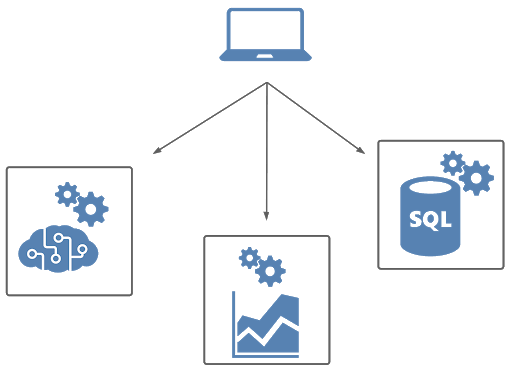
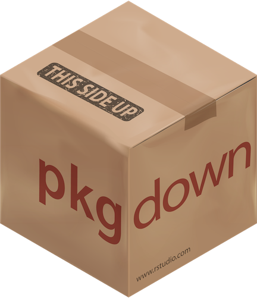
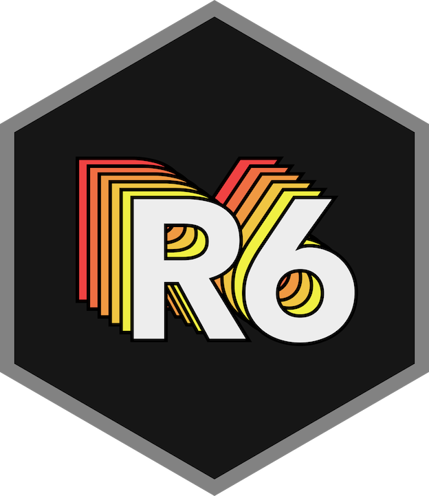
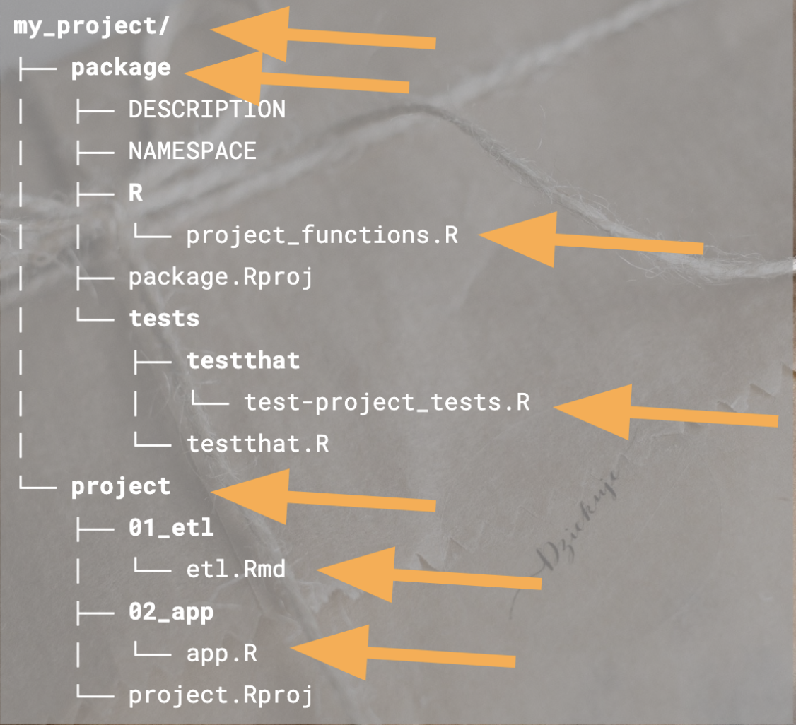
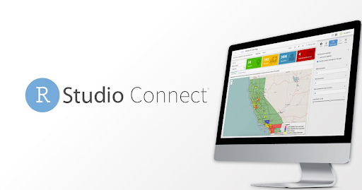
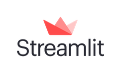
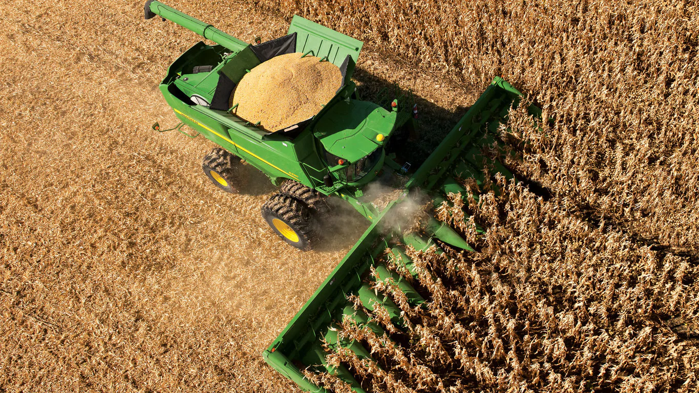
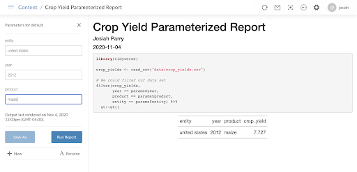
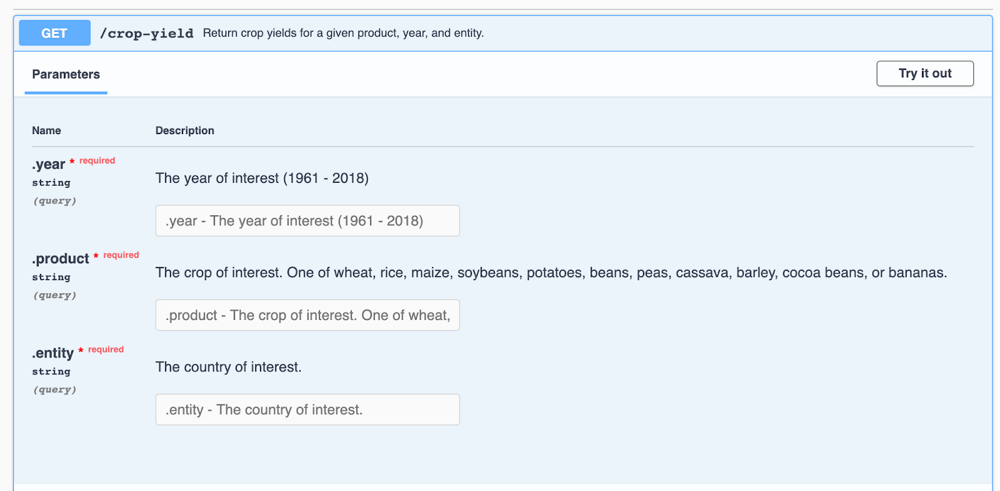

layout: true
background-image: url(slides_files/RStudio-Logo-Flat.png)
background-position: 2% 98%
background-size: 10%
---
name: title
class: inverse, center, middle
# Taming the Shiny beast
### Katie Masiello, Josiah Parry, Alex Gold


---
```{r setup, include=FALSE, warning=FALSE}
knitr::opts_chunk$set(echo = TRUE)
library(magrittr)
library(gt)
library(flair)
```

```{r include=FALSE, warning=FALSE}
xaringanExtra::use_share_again()
xaringanExtra::style_share_again(
  share_buttons = c("none")
)
```
class: center, middle  

# Shiny, I love you, but...

---
class: inverse
.pull-left[
# How it started...

] 
--
.pull-right[
# How it's going

]
---

.left-column-impact[
<h6 > 7</h6>
<h7>signs it's time to break up</h7>
]

.right-column[
<br><br><br><br>
1. It's a monolith

1. Updating is scary / hard

1. The idea of handing it off or inheriting it is terrifying

1. Performance issues

1. Redundant code

1. Other teams want to use your code

1. Other teams or tools don't speak R

]

---
# Monolith
```{r  out.width = "60%", echo=FALSE, eval=TRUE, fig.align='center'}
knitr::include_graphics("slides_files/monolith.png")
```

---
# Lean it out
```{r  out.width = "90%", echo=FALSE, eval=TRUE, fig.align='center'}

```

---
class: inverse 

.left-column-impact[
<h6 style="color:#FFFFFF"> 4</h6>
<h7>Patterns to break up big apps</h7>
]

.right-column[
<br>
###1. APIs &nbsp;

###2. Write a  &nbsp; 

###3. Use &nbsp; &nbsp; modules

###4. Write an &nbsp; &nbsp; Class 

]
---
# The Case for Packages &nbsp; 
.pull-left[
* One package per project

* Project-level reliability
  * Unit testing! 

* Team-wide collaboration
  * Analytics
  * Plotting
  * Templates
  * Data Access


]
.pull-right[

]
<br>
*But what if your analytics need to be shared outside of the R-ecosystem?*

---
class: inverse, center, middle
# “Gather together those things that change for the same reason, and separate those things that change for different reasons.”
---
class: inverse, center, middle
# Okay, but how?
---
class: inverse, center, middle
# APIs, that's how.
---
class: inverse, center, middle
# AP-who?
---
# TL;DR - APIs

* Application Programming Interfaces  

* Machines talking to machines

* RESTful APIs use HTTP

* Think of HTTP as a universal language

---
# Conceptualizing APIs

* Think of an API like a function  

* Functions have arguments and do something 

* APIs have parameters and do something

* `function(argument = value)`

* `http://hostname:8888/api_endpoint/?parameter=value`

---
# Data Science Tool Box

* PDF reports

* PowerPoint presentations

* Spreadsheets

* Interactive Dashboards

* *etc.*

* Limited to end user consumption

---
# Data Science Tool Box

* PDF reports

* PowerPoint presentations

* Spreadsheets

* Interactive Dashboards

* *etc.*

* **~APIs~**

---
class: inverse, center, middle

# Why an API?

---
# Organizational

* Smaller pieces are easier to manage (less code!)

* Component Monitoring 

* Infrastructure for recycled code 

* Less technical debt! 

* Better change management
  * Upgrade one service at a time without bringing down whole application

---
# Collaborative

* Less friction in tool handoff 

* Empower teams to use preferred tool chain

* Concerned about API requests not software language

* Reduced effort in tool hand off

  * No need to translate work
  
  * Not blocked by communication

* Programmatic use of services by other teams

  * Whereas dashboards require user intervention

* **_Glue together API requests! Pipelines, baby!_** 

---
# Signs you might be ready to create an API

* Redundant code (copying and pasting/reusing)

* Other teams want your code

* Other teams may not know your language

* You want to integrate different software into one toolchain

---
class: inverse, center, middle

# How do you build an API?

---
# API frameworks?

* R - plumber

* Python - Flask, Fast API

* JavaScript - Node.js & Express.js

---
class: inverse, center, middle

# How do you deploy an API?

---
# Deployment Options
.pull-left[

* RStudio Connect

* Digital Ocean

* Docker
]
.pull-right[
```{r  out.width = "90%", echo=FALSE, eval=TRUE, fig.align='right'}

```

``` {r out.width = "45%", echo=FALSE, eval=TRUE, fig.align='right'}
knitr::include_graphics("slides_files/digitalocean.png")
knitr::include_graphics("slides_files/docker.png")
```
]
---
class: center, middle

# Why limit your stack to

 

---
class: center, middle

# When it could be this


 <br>


---
class: inverse, center, middle

# Let's get into it

---
# Parts of an API
* **Host (fixed):**  
  * <span style="background-color:#fff2cc">`http://api.hostname.io/`</span>

* **Endpoint:** 
  * Resource location (think of as a function)
  * `http://api.hostname.io/`<span style="background-color:#fff2cc">`end-point`</span>

* **Parameters (optional):** 
  * Address varying parts of a request 
  * `http://api.hostname.io/end-point/`<span style="background-color:#fff2cc">`?param=value`</span>

* **Headers & body (optional):** 
  * (not in URL) Associated (meta)data 
---
# API Requests
* Each API endpoint has a different **method**  

* **GET**
  * Used to <span style="background-color:#fff2cc">*retrieve*</span> data. Parameters only. No body.
  * Everything is in the URL.
  * Don’t send sensitive data! 
  
* POST
  * Used for sending data (files or text). More secure.
  * Creating or modifying something.
  
* Other methods:
  * PUT
  * DELETE (yikes!)
  * HEAD
  * … 
---
# APIs as a Maturity Process 

* The one off analysis

* The *what ifs*?

  * Parameterized Rmd

  * Shiny Dashboard

* Need programmatic access  

  * Function
  
  * API
  
---
# Example: Global Crop Yields
.pull-left[
* [TidyTuesday Week 36, 2020](https://github.com/rfordatascience/tidytuesday/blob/master/data/2020/2020-09-01/readme.md) 

* Goal: 
  * Fetch crop yields for a given crop, year, and country 
  
* Ad hoc analysis 

* Parameterized Rmd

* Function 

* Plumber API
]

.pull-right[

]
---
# Example: ad hoc analaysis
```{r eval=FALSE}
library(tidyverse)

crop_yields <- read_csv("data/crop_yields.csv")

# We could filter our data set
filter(crop_yields,
      year == 2018,        
      product == "maize",
      entity == "cuba")

## # A tibble: 1 x 4
##   entity  year product crop_yield
##   <chr>  <dbl> <chr>        <dbl>
## 1 cuba    2018 maize         2.39

```
---
# [Parameterized Rmd](https://colorado.rstudio.com/rsc/connect/#/apps/7597/access/4133)
```{r  out.width = "100%", echo=FALSE, eval=TRUE, fig.align='center'}

```
---
# Making it functional
* Functions are code shortcuts!

* Functions are a special kind of object

* Arguments are placeholders

* Whatever is printed last is returned

```{r}
my_fun <- function(arg) {
 # do something with the argument
 arg
}

my_fun("Hello!")
## [1] "Hello!"
```
---
# What is changing?

* Things that change should be arguments  
```{r, echo=FALSE}
decorate("filter(crop_yields, 
         year == 2018, 
         product == \"maize\", 
         entity == \"cuba\")", eval=FALSE) %>% 
  flair("2018") %>%
  flair("\"maize\"") %>% 
  flair("\"cuba\"") %>% 
  knit_print.with_flair()
```

* Making the skeleton  
```{r echo=FALSE}
decorate("filter_yields <- function(.year, .product, .entity) {
	 # This is where our filtering will go! 
}", eval=FALSE) %>% 
  flair(".year") %>%
  flair(".product") %>% 
  flair(".entity") %>% 
  knit_print.with_flair()
```

* Using a '.' to avoid confusion in the `filter()`
---
# Example: making it functional
```{r eval=FALSE}
filter_yields <- function(.year, .product, .entity) {

 filter(crop_yields,
      year == .year,
      product == .product,
      entity == .entity)
}

filter_yields(2012, "potatoes", "guatemala")

## # A tibble: 1 x 4
##   entity     year product  crop_yield
##   <chr>     <dbl> <chr>         <dbl>
## 1 guatemala  2012 potatoes       25.0


```

---
class: inverse, center, middle
# You’ve basically made an API already

---
class: inverse, center, middle


```{r, results = "asis", echo = FALSE}
"https://colorado.rstudio.com/rsc/crop-yield-api/crop-yield ?.year=1978&.product=cassava&.entity=congo" %>%
  flair("https://colorado.rstudio.com/rsc/", color = "tomato") %>%
  flair("crop-yield-api/", color = "cornflowerblue") %>%
  flair("crop-yield ", color = "orange") %>%
  flair("?.year=1978&.product=cassava&.entity=congo", color = "darkseagreen") %>% 
  flair_all(before = "<h1>", after = "</h1>") %>%
  cat()
```

## <span style="color:tomato">host/</span><span style="color:cornflowerblue">RSC content path/</span><span style="color:orange">endpoint</span><span style="color:darkseagreen">?parameters</span>
---
# The API
```{r, API, eval=FALSE}
library(plumber)
library(tidyverse)

crop_yields <- read_csv("data/crop_yields.csv")

#* @apiTitle Crop Yields API
#* Return crop yields for a given product, year, and entity.
#* @param .year The year of interest (1961 - 2018)
#* @param .product The crop of interest. One of wheat, rice, maize, soybeans, potatoes, beans, peas, cassava, barley, cocoa beans, or bananas.
#* @param .entity The country of interest.
#* @get /crop-yield

function(.year, .product, .entity) {
 filter(crop_yields,
        year == .year,
        product == .product,
        entity == .entity)
}


```
---
# The API
```r
library(plumber)
library(tidyverse)

crop_yields <- read_csv("data/crop_yields.csv") 

*#* @apiTitle Crop Yields API 
#* Return crop yields for a given product, year, and entity.
#* @param .year The year of interest (1961 - 2018)
#* @param .product The crop of interest. One of wheat, rice, maize, soybeans, potatoes, beans, peas, cassava, barley, cocoa beans, or bananas.
#* @param .entity The country of interest.
#* @get /crop-yield

function(.year, .product, .entity) {
 filter(crop_yields,
        year == .year,
        product == .product,
        entity == .entity)
}

```
---
# The API
```r
library(plumber)
library(tidyverse)

crop_yields <- read_csv("data/crop_yields.csv") 

#* @apiTitle Crop Yields API 
*#* Return crop yields for a given product, year, and entity.
#* @param .year The year of interest (1961 - 2018)
#* @param .product The crop of interest. One of wheat, rice, maize, soybeans, potatoes, beans, peas, cassava, barley, cocoa beans, or bananas.
#* @param .entity The country of interest.
#* @get /crop-yield

function(.year, .product, .entity) {
 filter(crop_yields,
        year == .year,
        product == .product,
        entity == .entity)
}

```
---
# The API
```r
library(plumber)
library(tidyverse)

crop_yields <- read_csv("data/crop_yields.csv") 

#* @apiTitle Crop Yields API 
#* Return crop yields for a given product, year, and entity.
*#* @param .year The year of interest (1961 - 2018)
*#* @param .product The crop of interest. One of wheat, rice, maize, soybeans, potatoes, beans, peas, cassava, barley, cocoa beans, or bananas.
*#* @param .entity The country of interest.
#* @get /crop-yield

function(.year, .product, .entity) {
 filter(crop_yields,
        year == .year,
        product == .product,
        entity == .entity)
}

```
---
# The API
```r
library(plumber)
library(tidyverse)

crop_yields <- read_csv("data/crop_yields.csv") 

#* @apiTitle Crop Yields API 
#* Return crop yields for a given product, year, and entity.
#* @param .year The year of interest (1961 - 2018)
#* @param .product The crop of interest. One of wheat, rice, maize, soybeans, potatoes, beans, peas, cassava, barley, cocoa beans, or bananas.
#* @param .entity The country of interest.
*#* @get /crop-yield

function(.year, .product, .entity) {
 filter(crop_yields,
        year == .year,
        product == .product,
        entity == .entity)
}

```
---
class: inverse, center, middle
# The Swagger Interface
---
# Swagger
```{r  out.width = "100%", echo=FALSE, eval=TRUE, fig.align='center'}

```
---
class: inverse, center, middle
# Calling the API from R {httr}
---
# API Call Steps:

* This pattern is the same for all languages

* Generate the query URL

* Make the request 

* Parse the response 
---
# Creating the URL

1. Specify the base URL  

2. Create named list with parameters and values  

3. Use modify_url() to fill in parameters  

```{r, eval=FALSE}
library(httr)
b_url <- 
 "https://colorado.rstudio.com/rsc/crop-yield-api/crop-yield"

params <- list(.year = 1975, 
               .product = "beans", 
               .entity = "germany")

{{ (query_url <- modify_url(url = b_url, query = params)) }}

```
`[1] "https://colorado.rstudio.com/rsc/crop-yield-api/crop-yield?.year=1975&.product=beans&.entity=germany"`
---
# Send the request

* Use the appropriate method  

  * e.g. `GET()`, `POST()`, `PUT()`

<span style="background-color:#fff2cc">`(res <- GET(query_url))`</span>

`## Response` 

`[https://colorado.rstudio.com/rsc/crop-yield-api/crop-yield?.year=1975&.product=beans&.entity=germany]`

`##   Date: 2020-11-08 20:34`  
`##   Status: 200`  
`##   Content-Type: application/json`  
`##   Size: 72 B`
---
# Parse the request

```r

*(resp_raw <- content(res, as = "text"))


"[{\"entity\":\"germany\",\"year\":1975,\"product\":\"beans\",\"crop_yield\":2.8749}]" 

*jsonlite::fromJSON(resp_raw)


##    entity year product crop_yield
## 1 germany 1975   beans     2.8749
```
---
class: inverse, middle, center
# Recap
---
# Recap

* APIs: computers talking to computers
 
* RESTful APIs use HTTP
 
* HTTP is language agnostic
 
* Add APIs to your DS toolbox
 
* Reduce communication barriers
 
* Enable programmatic use of tools

---
class: inverse, middle, center
# Thank you!
---
class: inverse, middle, center
# Let's talk about it.
